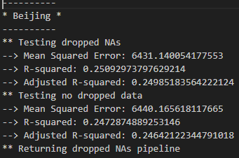
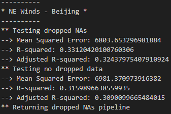
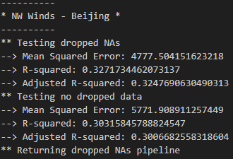
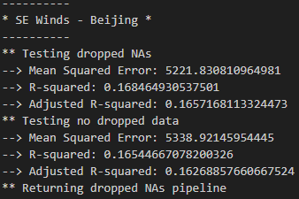
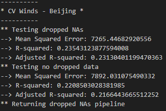

# Regression Mini-Project

## Introduction

We explored China Pollution data, cleaned the data in preprocessing steps and created an application that incorporates a machine learning pipeline.

## Files

| File | Function |                        
| ---- | ------------- |
| README.md | Project info |
| china_poll_ml_pipelines.ipynb | Main project markup |
| pipeline_utilities.py | Python functions |
| Resources/beijing-pm2-5.csv | Data source |
| Resources/beijing-pm2-5-NE.csv | Data sourcep |
| Resources/beijing-pm2-5-NW.csv | Data sourcep |
| Resources/beijing-pm2-5-SE.csv | Data sourcep |
| Resources/beijing-pm2-5-cv.csv | Data sourcep |

## Visuals and Explanations
* To depict the analysis we used Mean Squared, R-squared & Adjusted R-squared calculations. Below is a sample of the result.

**Beijing Metrics**

Beijing Metrics

**Beijing NE Metrics**

Beijing NE Metrics

**Beijing NW Metrics**

Beijing NW Metrics

**Beijing SE Metrics**

Beijing SE Metrics

**Beijing CV Metrics**

Beijing CV Metrics

## Documentation
https://pandas.pydata.org/docs/reference/frame.html

## Code of Conduct

This project has adopted the code of conduct defined by the Contributor Covenant to clarify expected behavior in our community.
For more information see the [Python Software Foundation Code of Conduct](https://policies.python.org/python.org/code-of-conduct/).

## Support

data-sourcing-challenge is an open-source project with a single maintainer. The best way to resolve your issue is to fix it yourself. Fork the repository and submit a pull request. 

### Get help

Ask the maintainer: [Chris Gilbert][1]

[1]: https://github.com/xraySMULu